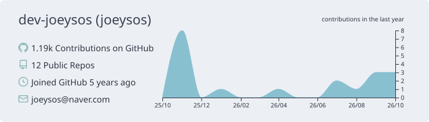
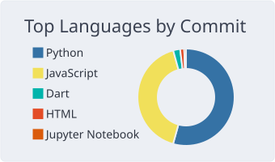
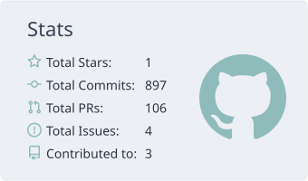

## HELLO 👋

> 누군가 저에게 이걸 왜 하냐고 물었을 때, 언제든 답할 수 있는 사람이 되고 싶습니다.

중앙대학교 소프트웨어학부를 졸업하고, **데이터·AI**와 **클라우드**를 공부하며 직접 만들어 보는 개발자 이건희입니다.

  

  
  

## PROJECTS 🚀

| 프로젝트 | 설명 |
|---|---|
| [🍽️ 식음업장 메뉴 수요 예측](https://github.com/dev-joeysos/menu-sales-prediction) | **2025.08** · LG Aimers 7기 해커톤 · LightGBM 시계열 예측 · 281위 / 1,779명 |
| [🚮 내쓰통](https://github.com/trashhcan/trashhcan-front) | **2024.11** · 멋쟁이사자처럼 중앙대 해커톤(중커톤) · 부담 없이 주고받는 "쓸모없는" 온라인 롤링페이퍼 · React 프론트엔드 · [서비스 바로가기](https://letterbin.netlify.app/) |
| [🚭 위하담](https://github.com/LikeLion12-Hackathon-Ppusher/Frontend) | **2024.07 ~ 09** · 멋쟁이사자처럼 12기 해커톤 · 흡연구역·간접흡연 위험 구역을 알려 주는 지도 서비스 · React 프론트엔드 · [서비스 바로가기](https://wehadam.netlify.app/) |
| [💪 베이트핏 (vveight fit)](https://github.com/dev-joeysos/vveight_fit) | **2024.03 ~ 06** · 캡스톤디자인 · 휴대폰 카메라만으로 VBT(속도 기반 훈련) 운동 루틴을 만들어 주는 Flutter 앱 |
| [🎤 ME:MIC](https://github.com/2023-CapstoneDesign-MEMIC/MEMIC-front-react) | **2023.09 ~ 12** · 캡스톤디자인 · 음향 추출·분석으로 성대모사를 도와주는 앱 · React 프론트엔드 담당 ([메인 저장소](https://github.com/2023-CapstoneDesign-MEMIC/MEMIC)) |

## STACKS 📚

**AI · Data** 

**Cloud · DevOps** 

**App · Web** 

**Language** 

## BLOG 🖼️

